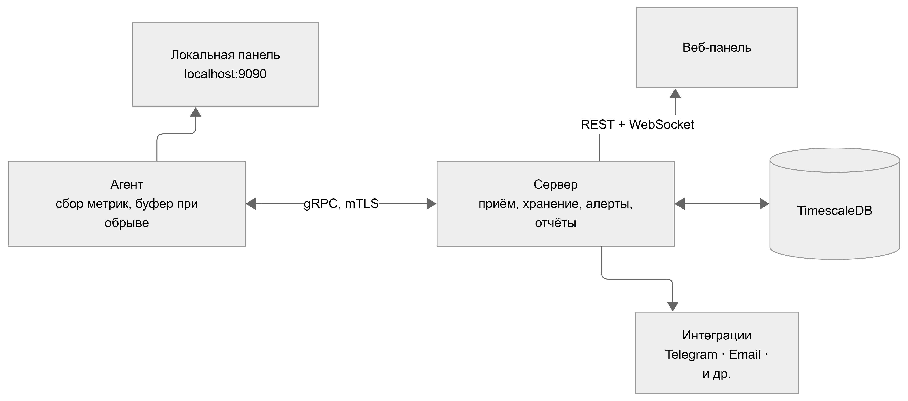

# monitoring system

Система мониторинга рабочих и серверных компьютеров в реальном времени. Предназначена для централизованного сбора, хранения, обработки и визуализации информации о состоянии подключенных компьютеров.

## Основной функционал(планируемый)

- системные метрики - CPU, RAM, диски, сеть, GPU, температуры. Разрешение до 0.5–1 с, настраивается индивидуально для каждого агента;
- процессы - полные списки, топ по нагрузке, история появления и завершения;
- активность пользователя - активное окно, рабочие сессии, время простоя (режим рабочей станции);
- наблюдение - скриншот по запросу, стриминг с экрана;
- мониторинг сервисов - статус процессов и портов, healthcheck, системные события, Docker-контейнеры (режим сервера);
- инвентарь оборудования - комплектующие, ОС, серийные номера;
- файлы - просмотр разрешённых директорий на агенте, раздача файлов на агенты с сервера;
- аутентификация и разграничение прав;
- просмотр графиков, процессов, событий и сетевой активности;
- настройка предупреждений и уведомлений о неисправностях;

## Архитектура

Основные компоненты:

__Агент__ - легкий исполняемый файл под Windows и Linux. Собирает метрики, отправляет по gRPC-каналу серверу. Работает в режиме рабочей станции или сервера;  
__Сервер__ - принимает данные от агентов, пишет в TimescaleDB, отдаёт панели REST и WebSocket (для передачи данных в реальном времени), рассылает команды агентам и уведомления во внешние сервисы.  
__Веб-панель__ - обзор подключенных агентов и групп, их детальные страницы, отчёты, уведомления, настройки.  
__Локальная панель агента__ - встроена в агента, доступна на localhost:9090. Показывает метрики своего ПК, процессы, файлы и настройки подключения.  

